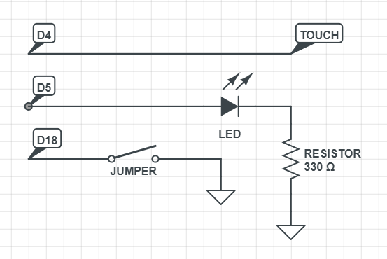

# Touch Button

#### Simple example using a touch pin in ESP32 DEVKIT V1

## Circuit



## Code

### Part 1 - Variables

```
int pinToggle = 18; // jumper to switch between persistent or alternating
int pinoVerde = 5;  // green led pin
int pinoTouchOn = 4; // touch pad pin
int capacitanciaMaxima = 30; // capacitance threshold, the higher the value the greater the sensitivity
```

### Part 2 - Setup
```
void setup()
{
   Serial.begin(115200);
   delay(1000);
   pinMode(pinoVerde, OUTPUT); // set pinoVerde as an output
   pinMode(pinToggle, INPUT_PULLUP); // set pinToggle as an pull up input
}
```

### Part 3 - Loop
```
void loop()
{
  Serial.print("Valor: ");
  Serial.println(touchRead(pinoTouchOn)); // print capacitance value
  bool toggle = false; // set toggle mode as false (persistent)
  
  if(digitalRead(pinToggle) == HIGH) { // if the jumper is open, the mode changes to toggle
    toggle = true;
  }
  
  Serial.print("Toggle: ");
  Serial.println(toggle); // print mode (0: persistent, 1:toggle)
  
  int media = 0; // start calculating the average (100 values)

  for(int i=0; i< 100; i++)
  {
    media += touchRead(pinoTouchOn);
  }
   
  media = media / 100; // end of averaging
 
  if(media < capacitanciaMaxima && !toggle) // persistent mode
  {
    digitalWrite(pinoVerde, !digitalRead(pinoVerde)); // inverts the state of the port
    while(media < capacitanciaMaxima) { // while the touch is active
      delay(10);
      
      int soma = 0;

      for(int i=0; i< 100; i++)
      {
        soma += touchRead(pinoTouchOn);
      }
       
      media = soma / 100;
    }
  }
  
  if(media < capacitanciaMaxima && toggle)
  {
    digitalWrite(pinoVerde, HIGH); // turn on the led
    while(media < capacitanciaMaxima) { // while the touch is active
      delay(10);
      
      int soma = 0;

      for(int i=0; i< 100; i++)
      {
        soma += touchRead(pinoTouchOn);
      }
       
      media = soma / 100;
    }
    digitalWrite(pinoVerde, LOW); // turn off the led
  } 
  
  delay(10);
}
```
